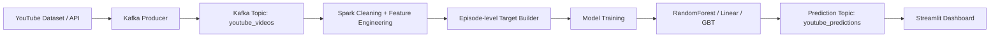

# YouTube Trending Prediction — FINAL PROJECT

Complete guide for running the streaming analytics pipeline with Kafka + Spark + Streamlit.

---

## 📋 Table of Contents
1. [Quick Start (5 min)](#quick-start)
2. [Docker Setup (Linux Local)](#docker-setup-linux-local)
3. [Services & Endpoints](#services--endpoints)
4. [Running Pipelines](#running-pipelines)
5. [Real-time Dashboard](#real-time-dashboard)
6. [Troubleshooting](#troubleshooting)
7. [Commands Reference](#commands-reference)

---

## 🚀 Quick Start

### Prerequisites
- **Docker Desktop** (Windows/Mac) OR Docker on Linux
- **Python 3.8+** (for local commands)
- **Java 11+** (optional, for local Spark)

### One-Command Start (Docker)
```bash
cd "/home/thinh/Documents/IS_BigData/BigData/FINAL PROJECT"

# If docker gives permission denied, use sudo or add your user to the docker group.
# Start the full stack: Kafka, Zookeeper, Kafka UI, Spark, and Streamlit.
sudo docker compose up -d

# Wait ~15 seconds for Kafka to be ready
sleep 15

# Create Kafka topics used by the project
sudo docker exec kafka kafka-topics --create --topic youtube_videos \
  --bootstrap-server localhost:9092 --partitions 3 --replication-factor 1 --if-not-exists
sudo docker exec kafka kafka-topics --create --topic youtube_predictions \
  --bootstrap-server localhost:9092 --partitions 3 --replication-factor 1 --if-not-exists

# Real YouTube API producer (recommended for real dashboard data)
nohup python3 -m app.producer_youtube \
  --kafka-servers localhost:9092 \
  --topic youtube_videos \
  --region-code VN \
  --max-results 10 \
  --poll-interval 20 \
  > producer_real.log 2>&1 &

# The producer loads YOUTUBE_API_KEY from .env automatically and will wait for Kafka if the broker is not up yet.

echo "✅ Services ready!"
echo "   📊 Kafka UI: http://localhost:8080"
echo "   📈 Streamlit: http://localhost:8501"
echo "   📤 Producer: Running (check with: ./status.sh)"
```

---

## 🧭 Architecture



The training pipeline now keeps full episode history per continuous trending window, so a video that disappears and later returns to Trending is handled as a separate episode instead of being merged into one label.

---

## 🔁 Data Flow

1. The producer fetches live trending videos from the YouTube API and publishes JSON to Kafka.
2. Spark Structured Streaming validates the payload, engineers features, loads the trained pipeline, and writes predictions back to Kafka.
3. The batch cleaner builds the training set from historical CSV data, detects trending episodes, and produces `trending_days` per episode.
4. The training job compares RandomForest, Linear Regression, and Gradient Boosting, then saves the best model plus comparison metrics.
5. The Streamlit dashboard consumes predictions, shows live charts, and reads saved metrics for RMSE / MAE / R², model comparison, and feature importance.

Realtime prediction output is shown in the consumer terminal from `app.consumer_predictions`, after `app.streaming_spark` publishes messages to the `youtube_predictions` Kafka topic.

---

## 🤖 Model Training

The main training entrypoint is:

```bash
python3 -m app.train_spark --data data/cleaned_youtube_regression.parquet
```

What it does:

1. Splits the data by time to avoid future leakage.
2. Trains and compares a Linear Regression baseline, Gradient Boosting, and a tuned RandomForestRegressor.
3. Tunes the RandomForest with Spark CrossValidator over `numTrees`, `maxDepth`, `minInstancesPerNode`, and `maxBins`.
4. Saves the best model to `models/rf_regression_model` and metrics to `metrics/regression_metrics.json`.

If you want the safer workflow that trains one model per run and can resume after reconnect, use:

```bash
./train_models_resume_wrapper.sh
tail -f logs/train_models_resume_*.log
```

That wrapper trains `linear_regression`, `gradient_boosting`, and `random_forest` in separate runs, then aggregates the results with `app.ml.aggregate_training_metrics` and copies the best model to `models/rf_regression_model` for prediction.

If you prefer explicit one-command-per-model runs, use:

```bash
./train_one_model.sh linear_regression
./train_one_model.sh gradient_boosting
./train_one_model.sh random_forest
python3 -m app.ml.aggregate_training_metrics
```

If you want the tuned RandomForest instead of the plain one, replace the third line with:

```bash
./train_one_model.sh random_forest_tuned
```

After aggregation, the best model is copied to `models/rf_regression_model`, so `python3 -m app.predict_spark --model-path models/rf_regression_model` always uses the latest winner.

---

## 🚢 Deployment

Start the platform with:

```bash
docker compose up -d
```

This starts Kafka, Zookeeper, Kafka UI, Spark master/worker, and Streamlit. The dashboard container mounts both `models/` and `metrics/`, so it can render saved training results without rebuilding the image.

To refresh the data pipeline manually:

```bash
python3 -m app.spark_data_cleaner
python3 -m app.train_spark
python3 -m app.predict_spark --model-path models/rf_regression_model --data data/cleaned_youtube_regression.parquet
python3 -m app.streaming_spark --model-path models/rf_regression_model --checkpoint-dir /tmp/spark_chkpt_youtube
```

If your SSH session tends to reconnect or drop during training, use the detached wrapper instead:

```bash
./train_predict_wrapper.sh
tail -f logs/train_predict_*.log
```

The wrapper defaults to the ultra-fast path, so it runs only Linear Regression plus the baseline and skips the heavyweight Spark models that can crash the JVM on constrained machines.

Nếu bạn đã cài thêm `xgboost` và `lightgbm` trong `requirements.txt`, training job sẽ tự động đưa hai mô hình này vào bảng so sánh; nếu chưa cài, job vẫn chạy bình thường với các model Spark MLlib.

---

## 🪟 Docker Setup (Linux Local)

### Architecture
```
Linux host
  ↓ docker compose / sudo docker compose
Docker Containers (Kafka, Spark, Streamlit, etc.)
```

### Step 1: Make Sure Docker Is Usable

1. Install Docker Engine and Compose on Linux.
2. Verify Docker works:

```bash
docker ps
```

3. If you get `permission denied`, run the project commands with `sudo` or add your user to the `docker` group:

```bash
sudo usermod -aG docker $USER
```

Then log out and log in again.

### Step 2: Confirm Compose Works

```bash
# Verify
docker --version
docker compose version
```

### Step 3: Start the Stack

```bash
cd "/home/thinh/Documents/IS_BigData/BigData/FINAL PROJECT"
sudo docker compose up -d zookeeper kafka kafka-ui streamlit
```

If you want all services at once, use:

```bash
sudo docker compose up -d
```

---

## 🔌 Services & Endpoints

| Service | URL/Port | Purpose |
|---------|----------|---------|
| **Kafka Broker** | `localhost:9092` | Producer/Consumer messaging |
| **Zookeeper** | `localhost:2181` | Kafka coordination |
| **Kafka UI** | `http://localhost:8080` | Kafka monitoring dashboard |
| **Spark Master** | `http://localhost:8081` | Spark cluster dashboard |
| **Spark Worker** | `http://localhost:8082` | Worker node status |
| **Streamlit Dashboard** | `http://localhost:8501` | Real-time visualization |

---

## 📊 Running Pipelines

### Realtime Run (Kafka → Spark → Streamlit)

> Dùng mục này nếu bạn muốn xem dự đoán realtime trên dashboard.

```bash
cd "/home/thinh/Documents/IS_BigData/BigData/FINAL PROJECT"

# 1) Start Kafka + Zookeeper
sudo docker compose up -d zookeeper kafka

# 2) Create topics
sudo docker exec kafka kafka-topics --create --topic youtube_videos \
  --bootstrap-server localhost:9092 --partitions 3 --replication-factor 1 --if-not-exists
sudo docker exec kafka kafka-topics --create --topic youtube_predictions \
  --bootstrap-server localhost:9092 --partitions 3 --replication-factor 1 --if-not-exists

# 3) Start streaming scorer (reads youtube_videos, writes youtube_predictions)
python3 -m app.streaming_spark \
  --kafka-servers localhost:9092 \
  --input-topic youtube_videos \
  --output-topic youtube_predictions \
  --model-path models/rf_regression_model \
  --checkpoint-dir /tmp/spark_chkpt_youtube \
  --checkpoint-policy unique

# 4) Start YouTube producer in background
nohup python3 -m app.producer_youtube \
  --kafka-servers localhost:9092 \
  --topic youtube_videos \
  --region-code VN \
  --max-results 10 \
  --poll-interval 20 \
  > producer_real.log 2>&1 &

# 5) Start realtime consumer (optional, for terminal output)
python3 -m app.consumer_predictions \
  --kafka-servers localhost:9092 \
  --topic youtube_predictions

# 6) Start Streamlit dashboard
sudo docker compose up -d streamlit
# or: streamlit run app/streamlit_dashboard.py
```

Open the dashboard at **http://localhost:8501**.

### Predict (Batch Inference)

```bash
cd "/home/thinh/Documents/IS_BigData/BigData/FINAL PROJECT"

python3 -m app.predict_spark \
  --model-path models/rf_regression_model \
  --data data/cleaned_youtube_regression.parquet
```

### Pipeline 1: Batch ETL + Train Model (Local)

```bash
cd "/home/thinh/Documents/IS_BigData/BigData/FINAL PROJECT"

# 1) Clean data (reads CSV from data/, outputs parquet)
python3 -m app.spark_data_cleaner

# 2) Train and compare models
python3 -m app.train_spark \
  --data "data/cleaned_youtube_regression.parquet" \
  --num-trees 100 --max-depth 12 \
  --save-model "models/rf_regression_model"
```

### Pipeline 2: Real-time Streaming (Kafka + Spark + Dashboard)

**Terminal 1: Streaming Predictor**
```bash
cd "/home/thinh/Documents/IS_BigData/BigData/FINAL PROJECT"

# Start Kafka + Zookeeper first
sudo docker compose up -d zookeeper kafka

# Create topics
sudo docker exec kafka kafka-topics --create --topic youtube_videos \
  --bootstrap-server localhost:9092 --partitions 3 --replication-factor 1 --if-not-exists
sudo docker exec kafka kafka-topics --create --topic youtube_predictions \
  --bootstrap-server localhost:9092 --partitions 3 --replication-factor 1 --if-not-exists

# Start streaming predictor
python3 -m app.streaming_spark \
  --kafka-servers localhost:9092 \
  --input-topic youtube_videos \
  --output-topic youtube_predictions \
  --model-path models/rf_regression_model \
  --checkpoint-dir /tmp/spark_chkpt_youtube \
  --checkpoint-policy unique
```

**Terminal 2: Producer (YouTube API Data - run once, keep looping)**
```bash
cd "/home/thinh/Documents/IS_BigData/BigData/FINAL PROJECT"

# Start in background (continuous loop, no need to rerun command)
nohup python3 -m app.producer_youtube \
  --kafka-servers localhost:9092 \
  --topic youtube_videos \
  --region-code VN \
  --max-results 10 \
  --poll-interval 20 \
  > producer_real.log 2>&1 &

# Check it is running
ps aux | grep "app.producer_youtube" | grep -v grep

# Watch logs
tail -f producer_real.log

# Stop producer when needed
pkill -f "app.producer_youtube"
```

**Terminal 3: Prediction Consumer**
```bash
cd "/home/thinh/Documents/IS_BigData/BigData/FINAL PROJECT"

python3 -m app.consumer_predictions \
  --kafka-servers localhost:9092 \
  --topic youtube_predictions
```

**Terminal 4: Dashboard (or open in browser)**
```bash
# If using Docker:
sudo docker compose up -d streamlit

# Or local Streamlit:
python3 -m pip install -r requirements.txt -r requirements-streamlit.txt
streamlit run app/streamlit_dashboard.py
```

Then open: **http://localhost:8501**

### Quick Run (just predict + dashboard)

```bash
cd "/home/thinh/Documents/IS_BigData/BigData/FINAL PROJECT"

# Batch predict from the latest trained model
python3 -m app.predict_spark \
  --model-path models/rf_regression_model \
  --data data/cleaned_youtube_regression.parquet

# Start Streamlit dashboard with Docker
sudo docker compose up -d streamlit

# Or start Streamlit locally
streamlit run app/streamlit_dashboard.py
```

---

## 📊 Real-time Dashboard Guide

### 📈 Tab 1: Views Timeline
- **Line chart** of views over time
- Updates in real-time as data arrives
- Hover for exact values, zoom/pan with mouse

### 📊 Tab 2: Engagement Metrics
- **Multi-line chart** with normalized metrics
- Views, likes, comments on same scale
- Compare engagement patterns

### 📉 Tab 3: Distribution Analysis
- **Histograms** for views, likes, comments
- **Statistics table** (mean, max, min, std dev)
- Real-time distribution updates

### 📺 Tab 4: Latest Videos
- **Recent videos feed** (last 10)
- Shows: title, views, likes, country
- Most recent first

### Connection Status (Top)
- 🟢 **Green** = Connected to Kafka
- 🔴 **Red** = Connection lost
- Auto-retry enabled (5 attempts, 2 sec delay)

---

## 🔧 Troubleshooting

### ❌ "Cannot connect to Docker daemon"

**Cause:** Docker daemon is unavailable to your user

```bash
# Check current access
docker ps

# If permission denied, retry with sudo
sudo docker ps

# Or add your user to the docker group and log in again
sudo usermod -aG docker $USER
```

### ❌ "Cannot connect to Kafka broker"

```bash
# Check if Kafka is running
sudo docker ps | grep kafka

# Check logs
sudo docker logs kafka | tail -20

# Verify port is open
nc -zv localhost 9092

# If Kafka failed to start, reset it
sudo docker compose down -v
sudo docker compose up -d zookeeper kafka
```

### ❌ "InconsistentClusterIdException"

```bash
# Clean Kafka state and restart
bash scripts/reset_kafka.sh

# Or manually
sudo docker compose down -v
sudo docker compose up -d zookeeper kafka
```

### ❌ "ReadTimeoutError" while building Streamlit image

This usually happens when `pip` downloads large packages on a slow network.

```bash
# Rebuild Streamlit image only
sudo docker compose build --no-cache streamlit

# Start Streamlit container after build success
sudo docker compose up -d streamlit
```

If you still see timeout, retry the build command once more.

### ❌ Dashboard not updating / no data showing

1. Check producer is running: `ps aux | grep producer_youtube`
2. Check Kafka has messages:
   ```bash
  sudo docker exec kafka kafka-console-consumer --bootstrap-server localhost:9092 \
     --topic youtube_videos --from-beginning --max-messages 1
   ```
3. Check dashboard logs:
   ```bash
  sudo docker compose logs -f streamlit
   ```

### ❌ "No such file or directory" for .env

Producer looks for YouTube API key in `.env`:
```bash
# Create .env if missing
echo "YOUTUBE_API_KEY=your_key_here" > .env

# Or pass as argument
python3 -m app.producer_youtube --region-code US
```

---

## 📝 Commands Reference

### Docker Management

```bash
# Start Kafka + Zookeeper only
sudo docker compose up -d zookeeper kafka

# Start all services
sudo docker compose up -d

# Start specific services only
sudo docker compose up -d zookeeper kafka streamlit kafka-ui

# Stop all (keep data)
sudo docker compose stop

# Restart
sudo docker compose restart

# Stop and remove containers (keep volumes)
sudo docker compose down

# Remove everything including volumes (CLEARS DATA)
sudo docker compose down -v

# View logs
sudo docker compose logs -f                       # All services
sudo docker compose logs -f kafka                 # Specific service
sudo docker compose logs --tail=50 -f streamlit   # Last 50 lines

# Execute commands in container
sudo docker compose exec kafka bash
sudo docker compose exec streamlit python -c "..."
```

### Quick Scripts

```bash
cd "/home/thinh/Documents/IS_BigData/BigData/FINAL PROJECT"

# Check system status
sudo ./status.sh

# Start producer (synthetic data)
sudo ./producer_wrapper.sh 10        # Send data every 10 seconds

# Start producer (REAL YouTube API) in background
nohup python3 -m app.producer_youtube \
  --kafka-servers localhost:9092 \
  --topic youtube_videos \
  --region-code VN \
  --max-results 10 \
  --poll-interval 20 \
  > producer_real.log 2>&1 &

# Check/stop real producer
ps aux | grep "app.producer_youtube" | grep -v grep
tail -f producer_real.log
pkill -f "app.producer_youtube"

# Read predictions from Kafka
sudo ./consumer_wrapper.sh

# Reset Kafka state
bash scripts/reset_kafka.sh
```

### Kafka Topic Management

```bash
# List topics
sudo docker exec kafka kafka-topics --list --bootstrap-server localhost:9092

# Create topic
sudo docker exec kafka kafka-topics --create --topic youtube_videos \
  --bootstrap-server localhost:9092 --partitions 3 --replication-factor 1

# Describe topic
sudo docker exec kafka kafka-topics --describe --topic youtube_videos \
  --bootstrap-server localhost:9092

# Delete topic
sudo docker exec kafka kafka-topics --delete --topic youtube_videos \
  --bootstrap-server localhost:9092

# View messages
sudo docker exec kafka kafka-console-consumer --bootstrap-server localhost:9092 \
  --topic youtube_videos --from-beginning --max-messages 10
```

### Local Commands (Batch Pipeline)

```bash
cd "/home/thinh/Documents/IS_BigData/BigData/FINAL PROJECT"

# Data cleaning
python3 -m app.spark_data_cleaner

# Model training
python3 -m app.app_spark --data "data/cleaned_youtube_regression.parquet" \
  --num-trees 20 --max-depth 6 --save-model "models/rf_regression_model"

# Streaming predictor
python3 -m app.streaming_spark --kafka-servers localhost:9092 \
  --input-topic youtube_videos --output-topic youtube_predictions \
  --model-path models/rf_regression_model \
  --checkpoint-dir /tmp/spark_chkpt_youtube \
  --checkpoint-policy unique

# Producer
python3 -m app.producer_youtube --kafka-servers localhost:9092 \
  --topic youtube_videos --poll-interval 10

# Consumer (predictions)
python3 -m app.consumer_predictions --kafka-servers localhost:9092 \
  --topic youtube_predictions

# Dashboard
streamlit run app/streamlit_dashboard.py
```

### Cleanup

```bash
# Remove unused Docker resources
docker system prune -a

# Clear checkpoint directory for fresh streaming
rm -rf /tmp/spark_chkpt_youtube*

# Reset all Kafka data
bash scripts/reset_kafka.sh
```

---

## 📌 Important Notes

1. **Kafka State**: If streaming fails with `InconsistentClusterIdException`, run:
   ```bash
   bash scripts/reset_kafka.sh
   ```

2. **Checkpoint Directory**: Prefer `--checkpoint-policy unique` for streaming runs, or use a fresh checkpoint directory (e.g., `/tmp/spark_chkpt_youtube_2`) so Spark doesn't reuse stale offsets

3. **Producer**: Use `./producer_wrapper.sh` for synthetic data, or run `nohup python3 -m app.producer_youtube ... > producer_real.log 2>&1 &` for continuous real API data in background

4. **Local Spark**: If running Spark jobs locally, ensure:
   - `JAVA_HOME` is set correctly
   - `SPARK_HOME` points to your Spark installation
   - Python paths include Spark packages

5. **Docker permissions**: On Linux, `sudo` is the simplest way to run compose and wrapper scripts if your user is not in the `docker` group yet.
